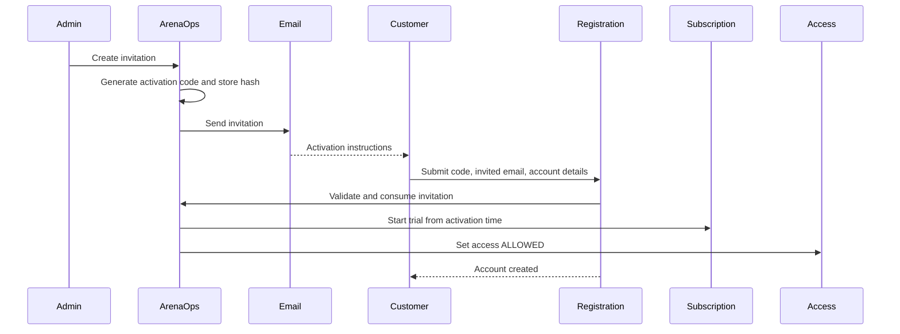
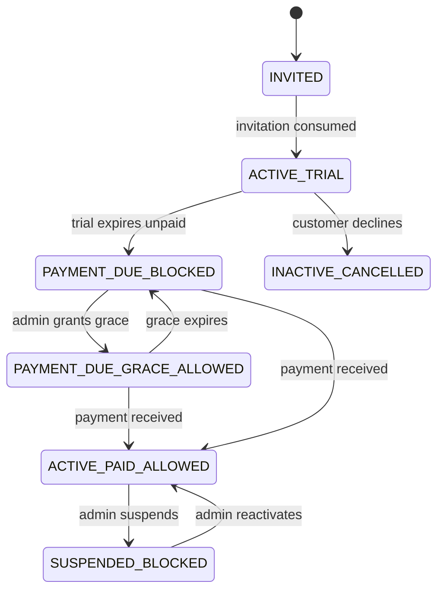
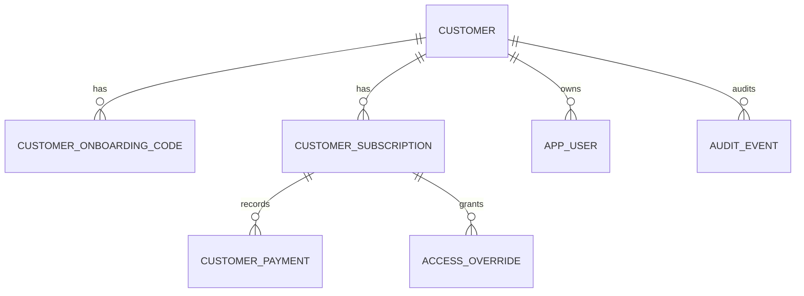

# ArenaOps Customer Onboarding, Subscription, and Access Architecture

## Purpose

This document describes the ArenaOps SaaS onboarding architecture implemented in the ArenaOps repository. It is intended for engineering, product, operations, and support teams.

## Business Problem

ArenaOps customers must not self-register without an ArenaOps-issued invitation. Admins invite an organization, ArenaOps generates a one-time activation code, the owner registers using the invited email, and the system controls trial, subscription, payment, grace, and access as separate business facts.

## Scope

This implementation covers admin-created invitations, activation-code validation, owner registration, registration-time trial start, trial expiry, manual payment recording, temporary grace access, cancellation, reactivation, admin suspension, backend access enforcement, audit events, and admin lifecycle display.

## Terminology

- Organization / Customer: The academy, arena, parlour, or sports business using ArenaOps.
- Invitation: The one-time onboarding credential created by an ArenaOps admin.
- Activation Code: A short-lived code sent to the invited owner email. It is not a permanent license.
- Subscription: The customer's commercial entitlement lifecycle.
- Payment: Manual MVP payment record and current payment state.
- Access: Whether authenticated users may use protected ArenaOps APIs.
- Grace Period: Temporary access while payment remains due.
- Audit Event: Historical record of lifecycle transitions.

## High-Level Onboarding Flow

1. Admin creates an invitation for an organization.
2. ArenaOps generates a secure random activation code.
3. ArenaOps stores only a hash for new activation codes.
4. The invitation email abstraction sends/logs the activation code.
5. Owner registers with the activation code and invited email.
6. Backend validates code status, expiry, one-time use, and email binding.
7. Registration consumes the invitation transactionally.
8. Customer becomes active.
9. Trial starts from registration time.
10. Access is allowed during the trial.

## Happy-Path Flow

Invitation starts as `CREATED`, then `SENT`. On successful owner registration:

- Customer: `ACTIVE`
- Invitation: `CONSUMED`
- Subscription: `TRIAL`
- Payment: `NOT_DUE`
- Access: `ALLOWED`

When payment is recorded:

- Subscription: `ACTIVE`
- Payment: `PAID`
- Access: `ALLOWED`

## Payment-Due Flow

When the trial expires without payment:

- Customer remains `ACTIVE`
- Subscription becomes `PAYMENT_DUE`
- Payment becomes `DUE`
- Access becomes `BLOCKED`

## Grace-Period Flow

An admin may grant grace only when subscription is `PAYMENT_DUE`.

- Subscription remains `PAYMENT_DUE`
- Payment remains `DUE`
- Access becomes `ALLOWED`
- Access override becomes `ACTIVE`

Payment during grace activates the subscription and revokes active grace.

## Non-Converted Trial Flow

If a customer explicitly declines after trial:

- Customer becomes `INACTIVE`
- Subscription becomes `CANCELLED`
- Payment becomes `NOT_DUE`
- Access becomes `BLOCKED`

Customer data remains retained.

## Paid Customer Suspension Flow

Admin suspension is independent of payment:

- Customer becomes `SUSPENDED`
- Subscription can remain `ACTIVE`
- Payment can remain `PAID`
- Access becomes `BLOCKED`

## Customer Lifecycle States

Implemented by `CustomerStatus`:

- `INVITED`
- `ACTIVE`
- `INACTIVE`
- `SUSPENDED`

Stored on `customer.customer_status`.

## Invitation Lifecycle States

Implemented by `InvitationStatus`:

- `CREATED`
- `SENT`
- `CONSUMED`
- `EXPIRED`
- `REVOKED`

Stored on `customer_onboarding_code.invitation_status`.

## Subscription Lifecycle States

Implemented by `SubscriptionStatus`:

- `NOT_STARTED`
- `TRIAL`
- `ACTIVE`
- `PAYMENT_DUE`
- `CANCELLED`
- `EXPIRED`

Stored on `customer_subscription.subscription_status`.

## Payment Lifecycle States

Implemented by `PaymentStatus`:

- `NOT_DUE`
- `DUE`
- `PAID`
- `FAILED`

Current payment state is stored on `customer.payment_status`. Individual payment records are stored in `customer_payment`.

## Access Lifecycle States

Implemented by `AccessStatus`:

- `NOT_ALLOWED`
- `ALLOWED`
- `RESTRICTED`
- `BLOCKED`

Stored on `customer.access_status`.

## Grace / Access Override Lifecycle

Implemented by `AccessOverrideStatus`:

- `ACTIVE`
- `EXPIRED`
- `REVOKED`

Implemented override types:

- `GRACE_PERIOD`
- `ADMIN_TEMPORARY_ACCESS`

Stored in `access_override`.

## State Transition Table

| Scenario | Customer | Invitation | Subscription | Payment | Access | Grace |
|---|---|---|---|---|---|---|
| Invitation created | INVITED | CREATED/SENT | NOT_STARTED | NOT_DUE | NOT_ALLOWED | - |
| Registration succeeds | ACTIVE | CONSUMED | TRIAL | NOT_DUE | ALLOWED | - |
| Trial active | ACTIVE | CONSUMED | TRIAL | NOT_DUE | ALLOWED | - |
| Trial expires unpaid | ACTIVE | CONSUMED | PAYMENT_DUE | DUE | BLOCKED | - |
| Admin grants grace | ACTIVE | CONSUMED | PAYMENT_DUE | DUE | ALLOWED | ACTIVE |
| Payment during grace | ACTIVE | CONSUMED | ACTIVE | PAID | ALLOWED | REVOKED |
| Grace expires unpaid | ACTIVE | CONSUMED | PAYMENT_DUE | DUE | BLOCKED | EXPIRED |
| Payment after block | ACTIVE | CONSUMED | ACTIVE | PAID | ALLOWED | - |
| Customer declines | INACTIVE | CONSUMED | CANCELLED | NOT_DUE | BLOCKED | REVOKED |
| Admin suspension | SUSPENDED | CONSUMED | ACTIVE | PAID | BLOCKED | - |

## Domain / Entity Model

- `CustomerEntity`: organization/customer current state and legacy compatibility fields.
- `CustomerOnboardingCodeEntity`: invitation and activation-code hash.
- `CustomerSubscriptionEntity`: subscription lifecycle and trial/current-period timestamps.
- `CustomerPaymentEntity`: manual payment records.
- `AccessOverrideEntity`: grace periods and temporary access overrides.
- `AppUserEntity`: registered ArenaOps users linked to customers.
- `AuditEventEntity`: historical state transition evidence.

## Database Tables and Important Columns

- `customer`: `organization_name`, `primary_contact_email`, `customer_status`, `access_status`, `payment_status`, `activated_at`, `deactivated_at`, `suspended_at`.
- `customer_onboarding_code`: `invited_email`, `activation_code_hash`, `invitation_status`, `sent_at`, `consumed_at`, `revoked_at`, `expires_at`.
- `customer_subscription`: `customer_id`, `plan`, `subscription_status`, `trial_duration_days`, `trial_started_at`, `trial_ends_at`, `current_period_end`, `next_billing_date`.
- `customer_payment`: `customer_id`, `subscription_id`, `amount`, `currency`, `payment_status`, `payment_reference`, `payment_date`, `recorded_by`.
- `access_override`: `customer_id`, `subscription_id`, `override_type`, `status`, `starts_at`, `ends_at`, `reason`.
- `audit_event`: `event_type`, `customer_id`, `actor_type`, `actor_id`, `previous_state`, `new_state`, `reason`.

## Relationships

- One customer can have many invitations.
- One customer can have one or more subscription records.
- One subscription can have many payments.
- One customer/subscription can have many access overrides.
- One customer can have many app users.
- Audit events reference customer IDs for lifecycle evidence.

## API Endpoints

Admin endpoints in `AdminCustomerController`:

- `GET /api/admin/dashboard`
- `GET /api/admin/customers`
- `POST /api/admin/customers`
- `POST /api/admin/customers/invitations`
- `POST /api/admin/customers/{customerId}/invitations/resend`
- `POST /api/admin/invitations/{invitationId}/revoke`
- `POST /api/admin/customers/{customerId}/grace-period`
- `POST /api/admin/customers/{customerId}/payments`
- `POST /api/admin/customers/{customerId}/suspend`
- `POST /api/admin/customers/{customerId}/reactivate`
- `POST /api/admin/customers/{customerId}/cancel`

Registration endpoints in `RegistrationController`:

- `POST /api/registration/validate-invitation`
- `POST /api/registration/activate`

Legacy-compatible endpoint:

- `POST /api/users`

## Registration Validation Rules

Backend validation checks:

- Activation code exists.
- Invitation is `SENT` or `CREATED`.
- Invitation is not expired.
- Invitation is not revoked.
- Invitation is not consumed.
- Activation code has remaining use count.
- Submitted email equals invited email after normalization.
- Activation and invitation consumption happen transactionally.

## Security Considerations

New activation codes are random and stored hashed using `ActivationCodeService`. The plaintext code is returned in the creation/resend response and sent through the `InvitationEmailService` abstraction. Existing legacy plaintext records are still accepted as a compatibility fallback.

## Backend Access-Enforcement Approach

`CustomerAccessFilter` applies to protected `/api/**` endpoints after JWT authentication. `CustomerAccessService` evaluates customer status, subscription status, active grace override, and access status. Authenticated users can still receive HTTP 403 when `access_status` is `BLOCKED` or `NOT_ALLOWED`.

Admins bypass customer entitlement checks through `AdminAuthorizationService`.

## Trial-Expiry Behavior

`SubscriptionLifecycleScheduler` runs `AdminCustomerService.expireTrialsAndGracePeriods()` using `app.lifecycle.expiry-scan-ms`, defaulting to five minutes.

If a `TRIAL` subscription has `trial_ends_at` in the past:

- Subscription becomes `PAYMENT_DUE`
- Payment becomes `DUE`
- Access becomes `BLOCKED` unless active grace exists

## Grace-Expiry Behavior

Expired active access overrides become `EXPIRED`. If payment remains due, access becomes `BLOCKED`.

## Payment Activation Behavior

`recordPayment` creates `CustomerPaymentEntity`, sets subscription `ACTIVE`, sets payment `PAID`, computes the current period, sets next billing date, allows access, and revokes active grace.

## Cancellation / Reactivation Behavior

Cancellation marks customer `INACTIVE`, subscription `CANCELLED`, payment `NOT_DUE`, and access `BLOCKED`. Reactivation restores customer `ACTIVE` and derives access from the subscription or active grace state.

## Audit Events

Implemented audit events include:

- `CUSTOMER_INVITATION_CREATED`
- `INVITATION_EMAIL_SENT`
- `INVITATION_EMAIL_FAILED`
- `INVITATION_RESENT`
- `INVITATION_REVOKED`
- `CUSTOMER_REGISTERED`
- `TRIAL_STARTED`
- `TRIAL_EXPIRED`
- `PAYMENT_BECAME_DUE`
- `GRACE_GRANTED`
- `GRACE_EXPIRED`
- `PAYMENT_RECORDED`
- `SUBSCRIPTION_ACTIVATED`
- `SUBSCRIPTION_CANCELLED`
- `CUSTOMER_SUSPENDED`
- `CUSTOMER_REACTIVATED`

## Error Scenarios

The service rejects invalid activation codes, expired codes, revoked codes, consumed codes, wrong email, duplicate active customer activation, grace outside payment-due state, overlapping active grace, payment after cancellation, and revocation/resend of consumed invitations.

## Data Migration Considerations

Migration file:

- `arena-core/src/main/resources/db/changelog/features/R1_9_saas_lifecycle/01-saas-onboarding-lifecycle.xml`

The migration extends existing tables and creates new tables. It does not drop customer or invitation data. Existing `customer` rows are mapped to `customer_status = ACTIVE` and `access_status = ALLOWED`. Existing onboarding code `status` values are copied into `invitation_status`. Legacy plaintext code lookup remains as a compatibility path.

## Testing Strategy

Implemented tests:

- `AdminCustomerServiceTest.createsInvitationWithoutStartingTrial`
- `AdminCustomerServiceTest.activationRequiresInvitedEmailAndConsumesCodeOnce`
- `AdminCustomerServiceTest.graceAllowsAccessWithoutChangingPaymentOrSubscriptionTruth`
- `AdminCustomerServiceTest.paymentActivatesSubscriptionAndSuspensionOnlyBlocksAccess`

Build commands:

- `mvn test`
- `npm run build`

## Operational / Admin Flow

Admins open `/admin`, create an invitation, share or send the activation code, monitor separate lifecycle badges, and perform valid actions such as resend invitation, grant grace, record payment, suspend, reactivate, or cancel.

## Frontend Implementation

Admin component:

- `arena-ui/src/app/admin/admin-dashboard.component.ts`
- `arena-ui/src/app/admin/admin-dashboard.component.html`
- `arena-ui/src/app/admin/admin-dashboard.component.scss`

Registration component:

- `arena-ui/src/app/user-registration/user-registration.component.ts`
- `arena-ui/src/app/user-registration/user-registration.component.html`

## Implementation Mapping

| Business Concept | Implementation |
|---|---|
| Organization / Customer | `CustomerEntity`, table `customer` |
| Invitation | `CustomerOnboardingCodeEntity`, table `customer_onboarding_code` |
| Activation code hashing | `ActivationCodeService` |
| Invitation email | `InvitationEmailService`, `LoggingInvitationEmailService` |
| Subscription | `CustomerSubscriptionEntity`, table `customer_subscription` |
| Payment | `CustomerPaymentEntity`, table `customer_payment` |
| Access override / grace | `AccessOverrideEntity`, table `access_override` |
| Audit | `AuditEventEntity`, table `audit_event`, service `AuditService` |
| Trial/grace expiry | `SubscriptionLifecycleScheduler` |
| Lifecycle transitions | `AdminCustomerService` |
| Access guard | `CustomerAccessFilter`, `CustomerAccessService` |
| Admin API | `AdminCustomerController` |
| Registration API | `RegistrationController` |
| Migration | `R1_9_saas_lifecycle/01-saas-onboarding-lifecycle.xml` |

## Mermaid: Customer Onboarding Sequence

## Mermaid: State Transition Diagram

## Mermaid: Entity Relationship Diagram

## Future Enhancements

- Replace `LoggingInvitationEmailService` with SMTP/provider-backed email sender.
- Add payment gateway integration.
- Add admin detail view and audit timeline UI.
- Add organization-level multi-user invitation support for manager, coach, and staff roles.
- Add stricter migration mapping for legacy customers if production data exists.
